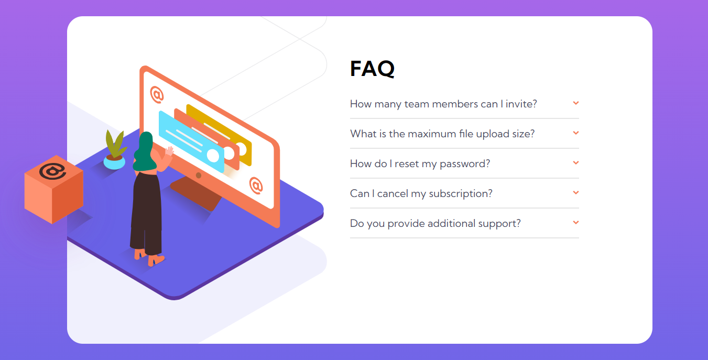

# Frontend Mentor - FAQ accordion card

Esta é uma solução para o [FAQ accordion card](https://www.frontendmentor.io/challenges/faq-accordion-card-XlyjD0Oam). Os desafios do Frontend Mentor ajudam você a melhorar suas habilidades de codificação criando projetos realistas.

## Índice

- [Visão geral](#visão-geral)
   - [O desafio](#o-desafio)
   - [Captura de tela](#captura-de-tela)
   - [Links](#links)
- [Construído com](#construído-com)
- [Autor](#autor)

## Visão geral

### O desafio

Os usuários devem ser capazes de:

- Ver o layout ideal para o componente, dependendo do tamanho da tela do dispositivo
- Ver os estados de foco para todos os elementos interativos na página
- Ocultar/Mostrar a resposta a uma pergunta quando a pergunta é clicada
### Captura de tela

### Links

- URL da solução: [HTML](./index.html)
- URL da solução: [CSS](./style.css)
- URL da solução: [JS](./main.js)
- URL do desafio no ar: [CODEPEN](https://codepen.io/davidsonaguiar/full/VwdBMBe)

## Construído com

- Marcação HTML5 semântica
- Propriedades personalizadas CSS
- Flexbox
- JavaScript
## Autor

- Website - [CODEPEN](https://codepen.io/davidsonaguiar)
- Frontend Mentor - [@davidsonaguiar](https://www.frontendmentor.io/profile/davidsonaguiar)
- Twitter - [@DavidsonAguiar5](https://twitter.com/DavidsonAguiar5)
