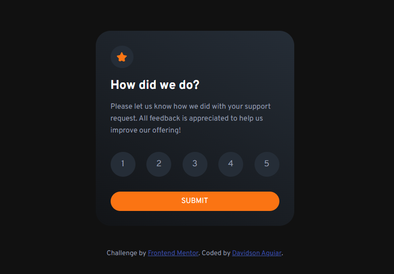

# Frontend Mentor - Interactive rating component

Esta é uma solução para o [desafio do componente de classificação interativa no Frontend Mentor](https://www.frontendmentor.io/challenges/interactive-rating-component-koxpeBUmI). Os desafios do Frontend Mentor ajudam você a melhorar suas habilidades de codificação criando projetos realistas.

## Índice

- [Visão geral](#visão-geral)
   - [O desafio](#o-desafio)
   - [Captura de tela](#captura-de-tela)
   - [Links](#links)
- [Meu processo](#meu-processo)
   - [Construído com](#construído-com)
   - [O que aprendi](#o-que-aprendi)
   - [Desenvolvimento contínuo](#desenvolvimento-contínuo)
   - [Recursos úteis](#useful-resources)
- [Autor](#autor)
- [Agradecimentos](#acknowledgments)

## Visão geral

### O desafio

Os usuários devem ser capazes de:

- Ver o layout ideal para o aplicativo, dependendo do tamanho da tela do dispositivo
- Ver os estados de foco para todos os elementos interativos na página
- Selecionar e enviar uma classificação numérica
- Ver o estado do cartão "Obrigado" após enviar uma avaliação

### Captura de tela

### Links

- URL da solução: [GITHUB](./index.html)
- URL do site ao vivo: [CODEPEN](https://codepen.io/davidsonaguiar/full/VwdBMBe)

## Meu processo

### Construído com

- Marcação HTML5 semântica
- Propriedades personalizadas CSS
- Flexbox
## Autor

- Website - [Adicione seu nome aqui](https://www.your-site.com)
- Frontend Mentor - [@yourusername](https://www.frontendmentor.io/profile/yourusername)
- Twitter - [@yourusername](https://www.twitter.com/yourusername)

**Observação: exclua esta observação e adicione/remova/edite as linhas acima com base nos links que deseja compartilhar.**

## Agradecimentos

É aqui que você pode dar uma gorjeta para qualquer pessoa que o ajudou neste projeto. Talvez você tenha trabalhado em equipe ou tenha se inspirado na solução de outra pessoa. Este é o lugar perfeito para dar-lhes algum crédito.

**Observação: exclua esta observação e edite o conteúdo desta seção conforme necessário. Se você concluiu este desafio sozinho, sinta-se à vontade para excluir esta seção completamente.**