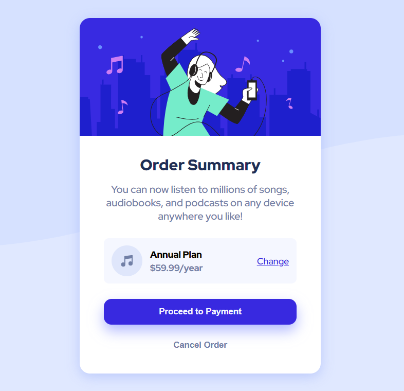

# Frontend Mentor - Order summary component

Esta é uma solução para o [Order summary component](https://www.frontendmentor.io/challenges/order-summary-component-QlPmajDUj). Os desafios do Frontend Mentor ajudam você a melhorar suas habilidades de codificação criando projetos realistas.

## Índice

- [Visão geral](#visão-geral)
   - [O desafio](#o-desafio)
   - [Captura de tela](#captura-de-tela)
   - [Links](#links)
- [Construído com](#construído-com)
- [Autor](#autor)

## Visão geral

### O desafio

Os usuários devem ser capazes de:

- Ver o layout ideal para o aplicativo, dependendo do tamanho da tela do dispositivo
- Ver os estados de foco para todos os elementos interativos na página
- Selecionar e enviar uma classificação numérica
- Ver o estado do cartão "Obrigado" após enviar uma avaliação

### Captura de tela

### Links

- URL da solução: [HTML](./index.html)
- URL da solução: [CSS](./style.css)
- URL do desafio no ar: [REPLIT](https://order-summary-component.davidsonrogerio.repl.co)

## Construído com

- Marcação HTML5 semântica
- Propriedades personalizadas CSS
- Flexbox
## Autor

- Website - [CODEPEN](https://codepen.io/davidsonaguiar)
- Frontend Mentor - [@davidsonaguiar](https://www.frontendmentor.io/profile/davidsonaguiar)
- Twitter - [@DavidsonAguiar5](https://twitter.com/DavidsonAguiar5)
